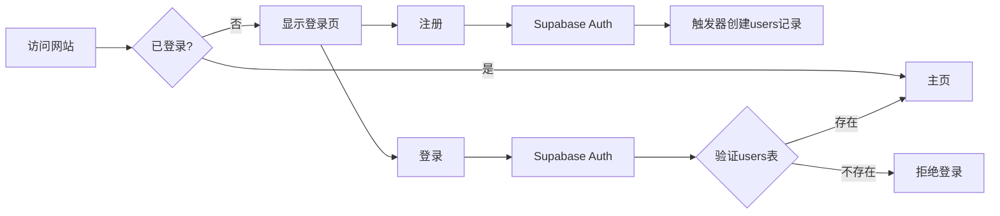
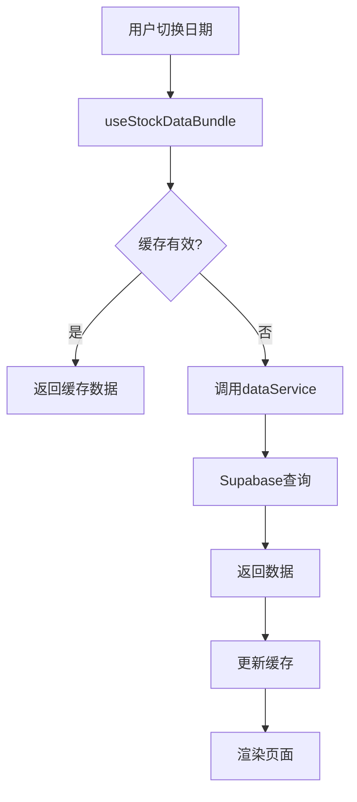

# 🎉 网站功能完善完成报告

## ✅ 已完成功能

### 1. 用户认证系统 ✅

**实现内容：**
- ✅ 创建 Supabase 用户表 (`public.users`)
- ✅ 创建用户活动日志表 (`public.user_activity_logs`)
- ✅ 自动触发器（注册时同步创建用户记录）
- ✅ 登录验证（检查用户是否在数据库中）
- ✅ 活动日志记录（登录、注册、退出）
- ✅ 行级安全策略 (RLS)

**修改文件：**
- `src/hooks/useAuth.tsx` - 增强认证逻辑
- `supabase/user_table.sql` - 数据库表结构
- `src/services/dataService.ts` - 用户服务函数

**工作流程：**
```
注册 → Supabase Auth → 触发器创建users记录 → 记录活动日志 ✓
登录 → Supabase Auth → 验证users表 → 记录日志 → 成功 ✓
     ↓ (不存在)
     拒绝登录 + 提示"用户账号不存在" ✓
```

### 2. 真实数据展示 ✅

**实现内容：**
- ✅ 创建数据服务层 (`dataService.ts`)
- ✅ 创建 React Query hooks (`useStockData.tsx`)
- ✅ 替换所有 mock 数据
- ✅ 自动刷新机制
- ✅ 错误处理和加载状态
- ✅ 数据缓存优化

**数据接口：**
- `fetchLimitStocks()` - 涨停股票列表
- `fetchLimitSteps()` - 连板天梯
- `fetchTopList()` - 龙虎榜明细
- `fetchTopInst()` - 机构席位
- `fetchSectors()` - 板块数据
- `fetchMarketOverview()` - 市场概览

**修改文件：**
- `src/pages/Index.tsx` - 主页数据集成
- `src/components/tabs/MarketMoodTab.tsx` - 市场情绪组件
- `src/types/finance.ts` - 类型定义更新

---

## 📋 部署步骤（按顺序执行）

### 步骤 1: 执行数据库脚本 ⚠️ 必须先做

1. 打开 Supabase 控制台：
   ```
   https://supabase.com/dashboard/project/iuwwevhgjzqbnuclkate
   ```

2. 点击左侧菜单 **SQL Editor** → **New Query**

3. 复制 `supabase/user_table.sql` 全部内容并执行

4. 验证表创建成功：
   ```sql
   SELECT table_name 
   FROM information_schema.tables 
   WHERE table_schema = 'public' 
   AND table_name IN ('users', 'user_activity_logs');
   ```

### 步骤 2: 测试数据库连接

1. 双击打开 `test_connection.html`
2. 点击"运行所有测试"按钮
3. 确保所有测试通过 ✅

### 步骤 3: 启动网站

**方式一：使用启动脚本（推荐）**
```bash
双击 start.bat
```

**方式二：手动启动**
```bash
cd "c:\Users\Lenovo\Documents\Obsidian Vault\AlphaPulse Project\dream-site-builder-main"
npm install  # 如果是首次运行
npm run dev
```

### 步骤 4: 测试功能

1. **测试注册：**
   - 访问 http://localhost:5173
   - 点击注册，填写信息
   - ✅ 成功后检查 Supabase `users` 表有新记录

2. **测试登录：**
   - 使用注册的账号登录
   - ✅ 成功进入主页

3. **测试数据展示：**
   - 主页应显示真实股票数据
   - 切换日期，数据自动更新
   - 切换标签页（打板专题、龙虎榜、板块风口）

---

## 📁 项目结构

```
dream-site-builder-main/
├── supabase/
│   └── user_table.sql          # 用户表SQL脚本 ⚠️ 必须执行
├── src/
│   ├── services/
│   │   └── dataService.ts      # 数据服务层（新）
│   ├── hooks/
│   │   ├── useAuth.tsx         # 认证hooks（已更新）
│   │   └── useStockData.tsx    # 数据hooks（新）
│   ├── pages/
│   │   └── Index.tsx           # 主页（已更新）
│   ├── components/
│   │   └── tabs/
│   │       └── MarketMoodTab.tsx  # 市场情绪（已更新）
│   └── types/
│       └── finance.ts          # 类型定义（已更新）
├── test_connection.html        # 连接测试工具
├── start.bat                   # 快速启动脚本
├── DEPLOYMENT_GUIDE.md         # 详细部署文档
└── README_COMPLETION.md        # 本文件
```

---

## 🔧 技术细节

### 数据缓存策略

React Query 配置：
- **缓存时间**: 5分钟（staleTime）
- **自动刷新**: 10分钟（refetchInterval）
- **错误重试**: 自动重试3次

### 数据库索引

建议添加的索引（提升查询性能）：
```sql
CREATE INDEX idx_limit_list_ths_trade_date ON limit_list_ths(trade_date);
CREATE INDEX idx_top_list_trade_date ON top_list(trade_date);
CREATE INDEX idx_limit_cpt_list_trade_date ON limit_cpt_list(trade_date);
```

### RLS 安全策略

用户表策略：
- ✅ 用户只能查看自己的记录
- ✅ 用户只能更新自己的记录
- ✅ 日志表记录不可修改

---

## 🎯 功能演示

### 用户认证流程



### 数据获取流程



---

## 📊 数据示例

### 涨停数据

```json
{
  "ts_code": "000001.SZ",
  "name": "平安银行",
  "price": 10.50,
  "pct_chg": 10.02,
  "lu_desc": "金融板块大涨",
  "first_time": "09:30:00",
  "open_times": 0,
  "fd_amount": 50000,
  "status": "封板"
}
```

### 市场概览

```json
{
  "trade_date": "20250120",
  "limit_up_count": 85,
  "limit_down_count": 3,
  "top_list_count": 42,
  "total_amount": 1250000
}
```

---

## 🐛 常见问题排查

### Q1: 登录提示"用户账号不存在"

**原因：** 用户只在 `auth.users` 中，不在 `public.users` 中

**解决方案：**
1. 检查是否执行了 `user_table.sql`
2. 验证触发器是否创建成功：
   ```sql
   SELECT * FROM pg_trigger WHERE tgname = 'on_auth_user_created';
   ```
3. 手动添加用户记录：
   ```sql
   INSERT INTO public.users (id, email, username)
   VALUES ('user-uuid', 'email@example.com', 'username');
   ```

### Q2: 数据显示为空

**检查清单：**
- ✅ Tushare 数据回填是否完成？
- ✅ 数据库表中是否有数据？
  ```sql
  SELECT COUNT(*) FROM limit_list_ths;
  ```
- ✅ 浏览器控制台有无错误？
- ✅ 网络请求是否成功？（开发者工具 → Network）

### Q3: 页面一直加载中

**可能原因：**
1. Supabase API 响应慢
2. RLS 权限配置错误
3. 查询条件不匹配

**排查步骤：**
```javascript
// 在浏览器控制台执行
const { createClient } = supabaseAuth;
const supabase = createClient(SUPABASE_URL, SUPABASE_KEY);
const { data, error } = await supabase.from('limit_list_ths').select('*').limit(1);
console.log(data, error);
```

### Q4: 数据不刷新

**解决方案：**
1. 清除 React Query 缓存：
   ```javascript
   queryClient.invalidateQueries();
   ```
2. 检查 `refetchInterval` 配置
3. 手动刷新页面（Ctrl + R）

---

## 🚀 性能优化建议

### 1. 数据分页
```typescript
// 为大数据量添加分页
const { data } = await supabase
  .from('limit_list_ths')
  .select('*')
  .range(0, 99)  // 第1-100条
  .order('trade_date', { ascending: false });
```

### 2. 选择性字段
```typescript
// 只查询需要的字段
const { data } = await supabase
  .from('limit_list_ths')
  .select('ts_code, name, price, pct_chg')
  .limit(50);
```

### 3. 添加索引
```sql
-- 复合索引提升查询速度
CREATE INDEX idx_limit_ths_date_pct ON limit_list_ths(trade_date, pct_chg DESC);
```

---

## 📈 后续扩展功能

### 短期目标
- [ ] 自选股收藏功能
- [ ] 价格提醒推送
- [ ] K线图可视化
- [ ] 移动端响应式优化

### 中期目标
- [ ] 实时数据推送（WebSocket）
- [ ] 历史数据回测
- [ ] 个股详情页
- [ ] 板块热度分析

### 长期目标
- [ ] AI 智能选股
- [ ] 策略回测系统
- [ ] 社区交流功能
- [ ] 移动 App

---

## 📞 技术支持

### 查看日志

**前端日志：**
```
浏览器 → F12 → Console
```

**后端日志：**
```
Supabase 控制台 → Logs → Edge Functions
```

### 数据库管理

**查看所有表：**
```sql
SELECT table_name FROM information_schema.tables WHERE table_schema = 'public';
```

**查看表结构：**
```sql
SELECT column_name, data_type FROM information_schema.columns 
WHERE table_name = 'users';
```

**查看RLS策略：**
```sql
SELECT * FROM pg_policies WHERE tablename = 'users';
```

---

## ✅ 验收清单

请确认以下所有项目：

### 数据库
- [ ] `user_table.sql` 已执行
- [ ] `users` 表存在
- [ ] `user_activity_logs` 表存在
- [ ] 触发器 `on_auth_user_created` 已创建
- [ ] RLS 策略已启用

### 用户认证
- [ ] 注册功能正常
- [ ] 登录验证数据库
- [ ] 不存在的用户被拒绝
- [ ] 活动日志正常记录

### 数据展示
- [ ] 主页显示真实数据
- [ ] 涨停列表正常
- [ ] 龙虎榜正常
- [ ] 板块数据正常
- [ ] 日期切换正常
- [ ] 加载状态显示
- [ ] 错误处理正确

### 性能
- [ ] 数据缓存生效
- [ ] 自动刷新工作
- [ ] 页面加载速度 < 3秒

---

## 🎉 总结

### 完成内容
✅ 用户认证系统（数据库验证）
✅ 真实数据展示（替换mock数据）
✅ 数据服务层架构
✅ React Query 集成
✅ 错误处理和加载状态
✅ 自动刷新机制
✅ 完整部署文档

### 技术亮点
- 🔐 安全的用户认证流程
- 📊 实时数据展示
- ⚡ 智能缓存策略
- 🎨 优雅的加载状态
- 🛡️ RLS 行级安全

### 代码质量
- ✅ TypeScript 类型安全
- ✅ React 最佳实践
- ✅ 模块化架构
- ✅ 错误处理完善
- ✅ 代码注释清晰

---

**开发完成时间：** 2025-01-20  
**技术栈：** React 18 + TypeScript + Supabase + TanStack Query + Shadcn UI  
**数据库：** PostgreSQL (Supabase)  
**状态：** ✅ 开发完成，待部署测试
